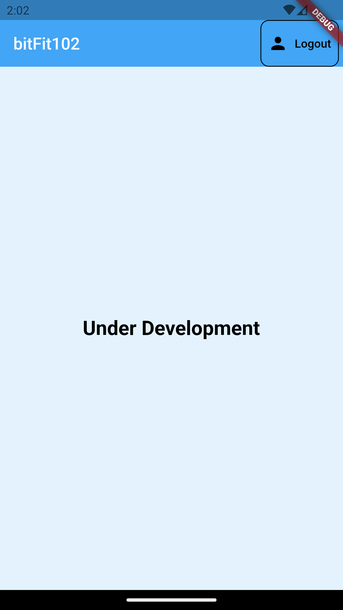
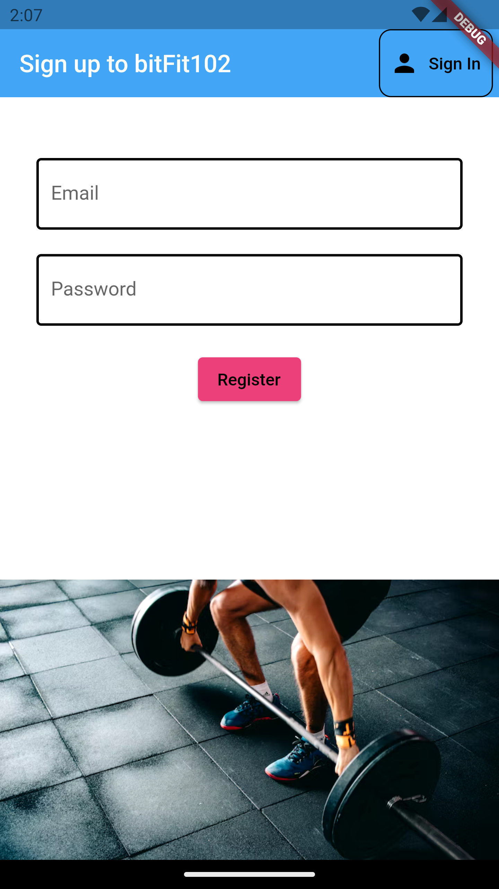
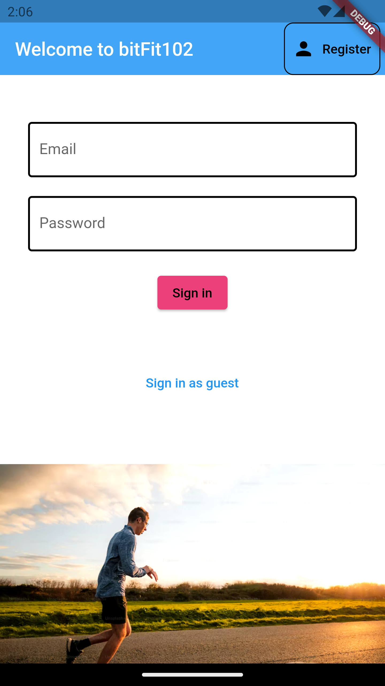

<h1>NUS Orbital 2023 - Milestone 1</h1>

**Proposed Level of Achievement:**

Project Gemini

**Motivation:**

One problem that people face when they want to start working out is that they do not know where to start, be it IPPT, Half Marathon Training or Weight Training. Some people would even like to train in a hyrbid style of both running and strength training, which not many applications have incorporated that. 

Thus, we strive to provide you with training plans that will cater to your fitness goals and to be in the best physical shape of your life. We provide training guides, a structured plan, and a workout log for you to keep track of your goals. 

**Aim:**

To provide user with training plans to reach their fitness goals. 

**User Stories:**

1\. As a user who does not know what training plan to select, I want to have a suitable

training plan to reach my fitness goals. 

2\. As a user who wants to train both running and strength, I want to be able to have a training

regime that incorporates both.

3\. As a user, I want to be able to track my workout progress over time and be able to see the 

improvement that I have made over a period of time. 

4\. As a user, I want to have guides to teach me how to perform a certain exercise if I am not 

sure of the proper technique.

**Scope of Project:**

The **iOS App & Android App** provides a interface for users to keep track of their workout plans.

Features to be completed by the mid of June:

1\. Inserting Fitness Goals

a. Users will be able to select the fitness goal.

2\. Workout Plan

a. Users will be able to see their progress of workout plan in their homepage.

3\. Explore Page

a. Users will have the flexibility to change their workout plan.

a. Insert **all** questions and answers into database

Features to be completed by the mid of July:

1\. Workout Log 

a. Users are able to keep track of their previous workouts.

2\. Profile Page

a. Users are able to see their current fitness level and identity within this page

**Tech Stack**

1\. Flutter + Dart

2\. Firebase (Backend)

**How are we different from similar platforms?**

● Hybrid Training Plan

○ The application provides a variety of Training Plans from running, to 

strength training, to IPPT goals. We incorporate these training plans as 

some people want to train both running and strength concurrently. 

**Development Plan**

**1st week of May:** Finalized pitch for Orbital Lift-off 
**2nd week of May:** Created Mockup
**3rd week of May:** Pick up necessary technologies - Flutter, Dart, Firebase 
**4th week of June:** Starting on Registration Page and do diagrams
**1st week of June:** Start on the Accordian for homepage (Stores current workout plan)
**3rd week of June:** Continue with homepage (Adding explore workout plans into homepage)
**4th week of June:** Testing and debugging
**1st week of July:** Implementation of peer teams’ suggestions
**2nd week of July:** Implement additional capabilities – Workout log 
**3rd week of July:** Testing and debugging

**User Guide**

<a href="https://drive.google.com/file/d/1J22HmkD2zGDA-fFhELvwZzgpn3XaJ1s6/view?usp=drive_link"> Click here for APK </a>

This is the link to our APK. To open the application, use supported web browsers (Chrome, Firefox or Safari), and make sure there is a stable internet connection.

Setting up:
Press the link from the provided URL. You can install the apk inside the phone in your browser. You can create an account through the sign up page if you don't have an account. If you have created an account previously, log in using your email and password. If you want to sign in as a guest to try out the features, you have the option to do so (Your data will not be stored). Note that we have yet to implement the option to change your password. 

**Mockup**

The **technical proof** is as shown below

