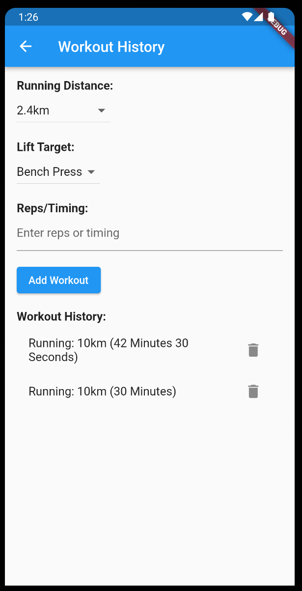

<h1>NUS Orbital 2023 - Milestone 2</h1>

**Proposed Level of Achievement:**

Project Gemini

**Motivation:**

One problem that people face when they want to start working out is that they do not know where to start, be it IPPT, Half Marathon Training or Weight Training. Some people would even like to train in a hyrbid style of both running and strength training, which not many applications have incorporated that.

Thus, we strive to provide you with training plans that will cater to your fitness goals and to be in the best physical shape of your life. We provide training guides, a structured plan, and a workout log for you to keep track of your goals.

**Aim:**

To provide user with training plans to reach their fitness goals.

**User Stories:**

1\. As a user who does not know what training plan to select, I want to have a suitable

training plan to reach my fitness goals.

2\. As a user who wants to train both running and strength, I want to be able to have a training

regime that incorporates both.

3\. As a user, I want to be able to track my workout progress over time and be able to see the

improvement that I have made over a period of time.

4\. As a user, I want to have guides to teach me how to perform a certain exercise if I am not

sure of the proper technique.

**Scope of Project:**

The **iOS App & Android App** provides a interface for users to keep track of their workout plans.

Features to be completed by the mid of June:

1\. Inserting Fitness Goals &#10004;

a. Users will be able to select the fitness goal.

2\. Workout Plan &#10004;

a. Users will be able to see their progress of workout plan in their homepage.

3\. Explore Page &#10004;

a. Users will have the flexibility to change their workout plan.

a. Insert **all** questions and answers into database

Features to be completed by the mid of July:

1\. Workout Log

a. Users are able to keep track of their previous workouts.

2\. Profile Page

a. Users are able to see their current fitness level and identity within this page

**Software Engineering Principles**

<h5>Project Management</h5>
<ul>
  <li>We used ClickUp to delegate and list down our tasks, and set priority to them depending on the urgency of tasks. We have a project log on Google Sheets to track our time spent on the project and the progress of the project. This helped us to ensure that each feature and milestone was properly tracked and completed on time.</li>
  <li>We divided the project into different parts for development.</li>
  <ul>
    <li>For milestone 1, we were familiarizing our tech stack and we completed the signup and login page.</li>
    <li>For milestone 2, we worked together to implement the features and functions of bitFit102 so that we can have a functional app.</li>
    <li>For milestone 3, we will be improving our app by providing more features and storing the saved workout in a database, and we will be focusing on the UI/UX of the application.</li>
  </ul>
  <li>
    We conduct regular meetings and discussions to evaluate our advancement and make any required modifications.</li>
  <li>We exchange the techniques we've acquired with one another and provide explanations of our code to ensure mutual understanding of our progress and each other's contributions.</li>
  <li> we strategically plan and assist each other with tasks, aiming to optimize efficiency of our application and providing the best experience for our users.</li>
</ul>

<h5>Version Control</h5>
<li> We used Git and GitHub to manage our source code and maintain a history of changes. This provided a centralized repository for code sharing and review so that we can collaborate effectively. </li>

<h5>SOLID Principles</h5>
<li> Single Responsibility Principle (SRP) </li>
<ul> 
    <li> We put our code of similar functions into one method so that if we want to change a specific method, we do not need to change it in other places. For example, for our Calendar page, we store the workout plan inside the same calendar instead of separate calendars for each training plan. </li>
</ul>
<li> Open Closed Priniciple (OCP) </li>
<ul>
    <li> We ensure that every class and method should be open for extension, but closed for modification. We utlized Flutter/Dart as our frontend framework and Firebase as our backend service/authentication. </li>
    <li> We were able to expand the behaviour of the application by developing within the current classes or reuse the exisiting classes in place. This helps to add features easily or make modifications with ease. </li>
    <li> For firebase, we are able to store the variables of each user that registers with ease, such that every user has a unique userId, and we can use that to track the workout of the user.</li>
</ul>

**Tech Stack**

1\. Flutter + Dart

2\. Firebase (Backend)

**How are we different from similar platforms?**

● Hybrid Training Plan

○ The application provides a variety of Training Plans from running, to

strength training, to IPPT goals. We incorporate these training plans as

some people want to train both running and strength concurrently.

**Development Plan**

1st week of May: Finalized pitch for Orbital Lift-off 
2nd week of May: Created Mockup 
3rd week of May: Pick up necessary technologies - Flutter, Dart, Firebase 
4th week of June: Starting on Registration Page and do diagrams 
1st week of June: Start on the Accordian for homepage (Stores current workout plan) 
3rd week of June: Continue with homepage (Adding explore workout plans into homepage) 
4th week of June: Testing and debugging 
1st week of July: Implementation of peer teams’ suggestions 
2nd week of July: Implement additional capabilities – Workout log 
3rd week of July: Testing and debugging

**User Guide**

<a href="https://drive.google.com/file/d/1x8HTvLvBR8zbG8OJoIPGee6URYkTMDpa/view?usp=sharing"> Click here for APK </a>

This is the link to our APK. To open the application, use supported web browsers (Chrome, Firefox or Safari), and make sure there is a stable internet connection.

Setting up:
Press the link from the provided URL. You can install the apk inside the phone in your browser. You can create an account through the sign up page if you don't have an account. If you have created an account previously, log in using your email and password. 

**Testing**
This is what we have tested for our app:
<a href="https://docs.google.com/document/d/1EnOHtQtoE0zRRydCGWU8OUs-fjHrqEurg5xcJ9hDB3k/edit?usp=sharing"> Click here for Test Cases </a>

**Mockup**

The **technical proof** is as shown below

